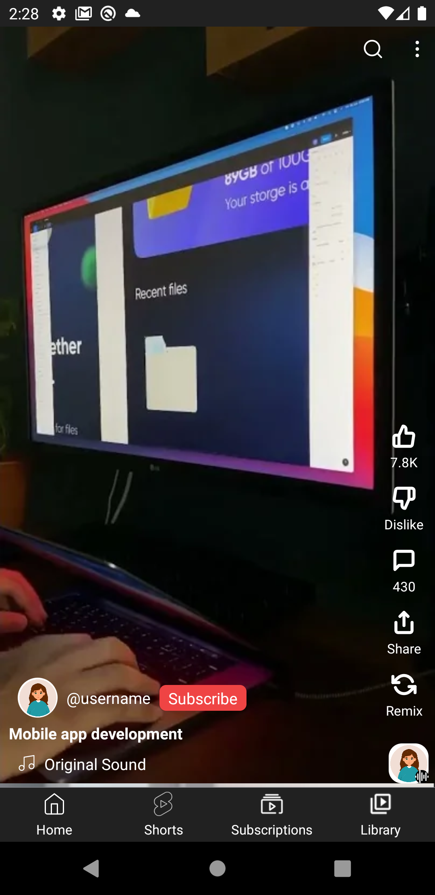

# React Native ile YouTube UI Klonu

~Bu projede, React Native kullanarak YouTube'un temel kullanıcı arayüzünü klonlamayı amaçlar. Tasarımı Tailwind CSS ile yapılmış olup, ekran yönlendirmeleri React Navigation ile gerçekleştirilmiştir.

# YouTube UI Clone with React Native

~This project aims to clone the basic user interface of YouTube using React Native. It has been styled with Tailwind CSS and screen navigation is handled using React Navigation.

